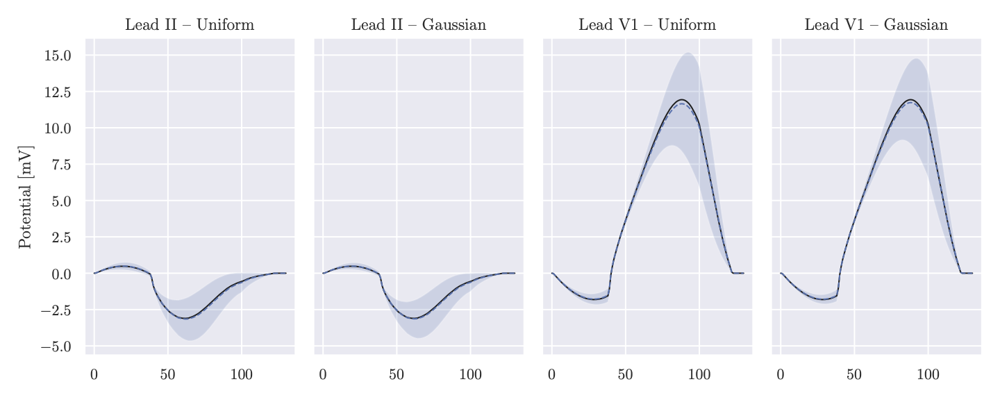

# Random ECGs

We present a method to efficiently evaluate the uncertainty in bidomain-based ECGs (mean, covariance)
when the position of the electrodes is uncertain.  The strategy is based on the lead field approach
and a low-rank decomposition of the covariance matrix.  The implementation is done in FEniCS.

 
‼️ Check out the implementation! :computer: Jupyter notebook: [Simulation2D.ipynb](Simulation2D.ipynb)

## Paper

The preprint

> Multerer M., Pezzuto S. Fast and Accurate Uncertainty Quantification for the ECG with Random Electrodes Location. 

is available on arXiv ([2102.09960](https://arxiv.org/abs/2102.09960)).

## Poster

The poster is available here: [FIMH2021](FIMH2021.pdf).
